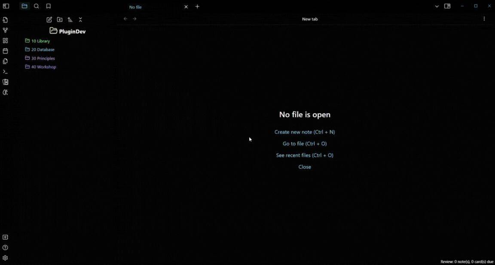

# Quiz Generator

 

**Quiz Generator** is a plugin for [Obsidian](https://obsidian.md/) that leverages the power of OpenAI's GPT-3.5 and GPT-4 models to automatically generate interactive, exam-style questions (with answers) based on your notes. Whether you're a student looking to quiz yourself or an educator creating assessments, this plugin streamlines the question creation process.



## Features

- **Personalized Questions:** Select any combination of notes and folders to use as the quiz content.
- **Customizable Generation:** Choose the type(s) and number of questions to generate.
- **Multiple Question Types:** Multiple choice, true/false, and short answer are all supported. Mix and match them to best suit your needs for an effective assessment.
- **Interactive UI:** Answer generated questions in an interactive UI that provides real-time feedback on correctness.
- **Question Saving:** Save generated questions in either (or both) of the following formats.
  - Inline and multiline flashcards to review with [obsidian-spaced-repetition](https://github.com/st3v3nmw/obsidian-spaced-repetition).
  - Markdown callouts for seamless integration with your notes.
- **Quiz Revisiting:** Re-open saved questions in the interactive UI (you can also write your own questions and open them in the UI).
- **Multiple Languages:** Generate questions in the same language as your notes.
- **Math Support:** Generate questions from notes that contain LaTeX.
- **Model Options:** Choose between OpenAI's latest GPT-3.5 and GPT-4 models, depending on your needs.
  - Use `gpt-3.5-turbo-0125` (16,385 token context window) for faster response times and efficient question generation with a moderate context window.
  - Use `gpt-4-0125-preview` (128,000 token context window) for more extensive content and in-depth question generation, suitable for complex educational materials and detailed assessments.

## Usage

### Installation

This plugin is currently under review to be added to the **Community plugins** page in Obsidian. Meanwhile, you can install it using either of the following methods.

#### BRAT Installation

1. Install [BRAT](https://github.com/TfTHacker/obsidian42-brat) from the **Community plugins** page in Obsidian.
   - **Settings** → **Community plugins** → **Browse**.
   - Search for `Obsidian42 - BRAT`.
   - Select the plugin to open its page and then select **Install**.
   - Select **Enable** on the plugin page or go back to the **Community plugins** page and toggle the switch.
2. Select `Add Beta plugin` in BRAT's settings.
3. Enter this repository's URL: `https://github.com/ECuiDev/obsidian-quiz-generator`.
4. Enable the plugin.
5. Open the plugin settings and enter your API key.
   - If you don't have an API key, create an account at [OpenAI](https://platform.openai.com/) and retrieve your API key from [API keys](https://platform.openai.com/api-keys).
6. Configure the other settings as desired.

#### Manual Installation

1. Download `main.js`, `manifest.json`, and `styles.css` from the [latest release](https://github.com/ECuiDev/obsidian-quiz-generator/releases).
2. Go to your Obsidian vault's `plugins` folder and create a new folder named `quiz-generator`.
3. Move the files you downloaded in step 1 to this folder.
4. Enable the plugin in the **Community plugins** page in Obsidian.
5. Open the plugin settings and enter your API key.
   - If you don't have an API key, create an account at [OpenAI](https://platform.openai.com/) and retrieve your API key from [API keys](https://platform.openai.com/api-keys).
6. Configure the other settings as desired.

### Generation

- Open the command palette and select "Quiz Generator: Open generator" or select the [brain-circuit](https://lucide.dev/icons/brain-circuit) icon in the left sidebar.
- Use the [file](https://lucide.dev/icons/file-plus-2) and [folder](https://lucide.dev/icons/folder-plus) icons to add notes and folders.
  - Adding a folder adds all of the notes inside it, as well as any notes in its subfolders. If you select an extremely large folder (thousands of files and hundreds of subfolders), it could take a few seconds for it to be added.
- Use the [x](https://lucide.dev/icons/x) icon to remove individual notes/folders and the [book](https://lucide.dev/icons/book-x) icon to remove everything.
- Once you've added your notes and/or folders, select the [webhook](https://lucide.dev/icons/webhook) icon to generate the questions.
  - The Quiz UI will open automatically when the generation is complete (it usually takes at least a few seconds).
  - The generation time may vary based on the length of your notes and the number of questions to generate.

### Saving

- Saved questions will be in a Markdown file named "Quiz [number]" in the folder specified by the "Save location" setting.
- Select the [save](https://lucide.dev/icons/save) icon to save the current question.
- Select the [save-all](https://lucide.dev/icons/save-all) icon to save all questions.
- If the "Automatically save questions" setting is enabled, all questions will be immediately saved upon generation.

### Opening Saved Quizzes

- Open the command palette and select "Quiz Generator: Open quiz from current note" or right-click a note in the file explorer and select "Open quiz from this note" in the file menu.

### Question Formatting

If you want to modify any saved questions or write your own questions from scratch, they must follow the format below to be opened in the interactive UI. Any text not enclosed by quotation marks must be written exactly as shown. However, deviations in spacing and capitalization are okay (the parser is case-insensitive and ignores whitespace). Text enclosed by quotation marks can be anything.

#### Callout Format

```
> [!question] "Multiple choice question goes here"
> a) "Choice 1"
> b) "Choice 2"
> c) "Choice 3"
> d) "Choice 4"
>> [!success]"- Answer"
>> One of a), b), c), or d) "You may optionally add the text of the correct choice in addition to the letter"

> [!question] "True/false question goes here"
> True or false?
>> [!success]"- Answer"
>> One of true or false

> [!question] "Short answer question goes here"
>> [!success]"- Answer"
>> "Answer goes here"

Note: The hyphen being inside the quotations marks in the nested callout is not a typo. It's optional whether you include it or not.
```

**Example**
```
> [!question] In the realm of artificial intelligence ethics, consider the development of autonomous weapon systems (AWS). Advocates argue that AWS can minimize human casualties in warfare, while critics express concerns about the lack of human control and potential ethical implications. Applying an ethical framework, which option aligns with a consequentialist perspective?
> a) Reject the use of AWS to preserve human control and uphold moral principles.
> b) Implement strict regulations and oversight to balance the benefits and risks of AWS.
> c) Embrace AWS deployment to reduce overall casualties and enhance military effectiveness.
> d) Encourage international collaboration to establish a global consensus on AWS usage.
>> [!success]- Answer
>> c) Embrace AWS deployment to reduce overall casualties and enhance military effectiveness.

> [!question] In the context of the nature vs. nurture debate in psychology, the consensus among researchers is that intelligence is solely determined by genetic factors.
> True or false?
>> [!success]- Answer
>> False

> [!question] Explain the concept of the "butterfly effect" in chaos theory and provide an example illustrating its significance.
>> [!success]- Answer
>> The "butterfly effect" is a phenomenon in chaos theory that suggests small initial changes can lead to vastly different outcomes over time. It is metaphorically expressed as the idea that the flap of a butterfly's wings in Brazil could set off a chain of events leading to a tornado in Texas. Essentially, tiny variations in the initial conditions of a complex system can have profound and unpredictable effects on its future state. An example of the butterfly effect is the weather, where a minor disturbance can influence atmospheric conditions, potentially leading to significant changes in weather patterns over time.
```

#### Spaced Repetition Format

```
**Multiple Choice:** "Multiple choice question goes here"
a) "Choice 1"
b) "Choice 2"
c) "Choice 3"
d) "Choice 4"
Multiline separator you chose in the settings goes here
One of a), b), c), or d) "You may optionally add the text of the correct choice in addition to the letter"

**True/False:** "True/false question goes here" Inline separator you chose in the settings goes here One of true or false

**Short Answer:** "Short answer question goes here" Inline separator you chose in the settings goes here "Answer goes here"
```

**Example**
```
**Multiple Choice:** In the realm of artificial intelligence ethics, consider the development of autonomous weapon systems (AWS). Advocates argue that AWS can minimize human casualties in warfare, while critics express concerns about the lack of human control and potential ethical implications. Applying an ethical framework, which option aligns with a consequentialist perspective?
a) Reject the use of AWS to preserve human control and uphold moral principles.
b) Implement strict regulations and oversight to balance the benefits and risks of AWS.
c) Embrace AWS deployment to reduce overall casualties and enhance military effectiveness.
d) Encourage international collaboration to establish a global consensus on AWS usage.
?
c) Embrace AWS deployment to reduce overall casualties and enhance military effectiveness.

**True/False:** In the context of the nature vs. nurture debate in psychology, the consensus among researchers is that intelligence is solely determined by genetic factors. :: False

**Short Answer:** Explain the concept of the "butterfly effect" in chaos theory and provide an example illustrating its significance. :: The "butterfly effect" is a phenomenon in chaos theory that suggests small initial changes can lead to vastly different outcomes over time. It is metaphorically expressed as the idea that the flap of a butterfly's wings in Brazil could set off a chain of events leading to a tornado in Texas. Essentially, tiny variations in the initial conditions of a complex system can have profound and unpredictable effects on its future state. An example of the butterfly effect is the weather, where a minor disturbance can influence atmospheric conditions, potentially leading to significant changes in weather patterns over time.
```

### Miscellaneous

- Select the [scroll](https://lucide.dev/icons/scroll-text) icon in the Generator UI to re-open the most recently generated quiz.

## Coming Soon

I'm actively working on bringing more features and improvements to Quiz Generator. Stay tuned for the following upcoming updates:

### Sequentially Being Developed

- **Improved Folders:** Click added folders to view the notes they contain.
- **Improved Notes:** Click added notes to view their contents.
- **More Question Types:** Fill in the blank, matching, essay/long answer, and select all that apply.
- **Dynamic Analysis:** Get real-time feedback on your response to short/long answer questions.
- **Adjustable Difficulty:** Set the difficulty of generated questions.
- **Tag Adder:** Add notes by tag.
- **Dataview Adder:** Add notes using [Dataview](https://github.com/blacksmithgu/obsidian-dataview) queries.
- **More Models:** Support for local LLM's and other LLM providers.
- **Advanced Question Types:** Numerical response and image-based.
- **Note Links:** Adding a note also adds the notes it links to.
- **Extended Files:** Generate questions from PDF and image files.

### Concurrently Being Developed

- **Question Variety:** Customization options to control the question style and what it assesses.
- **Quality of Life:** Reducing token usage while improving question quality.

## Limitations

Make sure the combined token count of your input (selected notes/folders) and expected output (generated questions) does not exceed the context window of your chosen model. Otherwise your input and/or output will be truncated. The number of input tokens is shown in the Generator UI. For the number of output tokens, on average, a multiple choice question is ~60 tokens, a true/false question is ~30 tokens, and a short answer question is ~100 tokens. I recommend leaving at least 10% of the context window unused to be safe.

## Issues and Feature Requests

If you encounter any errors or have feature requests, please open an issue on the [GitHub repository](https://github.com/ECuiDev/obsidian-quiz-generator/issues).
